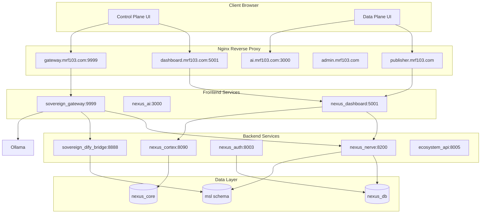

# NEXUS PRIME Frontend Architecture

**Date:** 2026-02-24  
**Purpose:** Network flow, database integration, component roles, and operational architecture.

---

## 1. Network and Operational Flow

### 1.1 High-Level Flow

```
Client Browser
    │
    ├── Control Plane UI (Dashboard ARC, Citadel, Admin, God Mode)
    │       │
    │       ├──► dashboard.mrf103.com:5001  → nexus_dashboard
    │       ├──► gateway.mrf103.com:9999   → sovereign_gateway
    │       └──► god.mrf103.com:8888       → sovereign_dify_bridge
    │
    └── Data Plane UI (Shadow Seven, X-BIO, 7th Shadow)
            │
            ├──► publisher.mrf103.com      → shadow-seven
            ├──► ai.mrf103.com:3000        → nexus_ai (Open WebUI)
            └──► mrf103.com/api/           → ecosystem_api:8005
```

### 1.2 Cloudflare DNS & Nginx Routing

**Server IP:** 46.224.225.96 — All subdomains resolve via Cloudflare A records.

| Subdomain | Backend | Port | Plane |
|-----------|---------|------|-------|
| admin.mrf103.com | ecosystem_api / admin static | 8005 | Control |
| citadel.mrf103.com | /var/www/citadel | — | Control |
| dashboard.mrf103.com, dash.mrf103.com | nexus_dashboard | 5001 | Control |
| monitor.mrf103.com | /var/www/monitor | — | Control |
| grafana.mrf103.com | Grafana | 3002 | Control |
| nerve-ui.mrf103.com | /var/www/nerve + nexus_nerve | 8200 | Control |
| god.mrf103.com | sovereign_dify_bridge | 8888 | Control |
| ai.mrf103.com, chat.mrf103.com, nexus.mrf103.com | nexus_ai | 3000 | Data |
| xbio.mrf103.com | xbio-sentinel | 8080 | Data |
| sultan.mrf103.com | ecosystem_api | 8005 | Data |
| publisher.mrf103.com | shadow-seven | 3001 | Data |
| finance.mrf103.com, marketing.mrf103.com | /var/www/* | — | Data |
| app.mrf103.com | nexus_dashboard | 5001 | Data |
| boardroom.mrf103.com | nexus_boardroom | 8501 | Data |
| platform.mrf103.com, sovereign.mrf103.com | ecosystem_api / dify_bridge | 8005/8888 | Data |
| voice.mrf103.com | nexus_voice | 5050 | Data |
| api.mrf103.com | ecosystem_api | 8005 | Infra |
| gateway.mrf103.com | sovereign_gateway | 9999 | Infra |
| dify.mrf103.com | Dify | 8085 | Infra |
| flow.mrf103.com, n8n.mrf103.com | nexus_flow | 5678 | Infra |
| memory.mrf103.com | nexus_memory_keeper | 9000 | Infra |
| oracle.mrf103.com | nexus_oracle | 8100 | Infra |
| nerve.mrf103.com | nexus_nerve | 8200 | Infra |
| cortex.mrf103.com | nexus_cortex | 8090 | Infra |
| prime.mrf103.com | Static | — | Infra |
| imperial.mrf103.com | /var/www/imperial | — | Infra |
| jarvis.mrf103.com | /var/www/jarvis | — | Infra |

### 1.3 Backend Service Dependencies

| Frontend | Consumes |
|----------|----------|
| Dashboard ARC | nexus_nerve (NERVE_URL), Express (enhanced-dashboard), Supabase/PostgREST |
| sovereign_gateway | nexus_nerve, nexus_apex, nexus_ollama, nexus_voice, sovereign_dify_bridge |
| God Mode | MSL schema, Dify |
| Shadow Seven | Shadow 7 backend |
| 7th Shadow | 7thshadow backend |
| ecosystem_api | clone_hub, nexus_prime |

---

## 2. Data Flow: Control Plane

1. **Operator** logs in via Dashboard ARC `POST /api/auth/login` (session-based, env: ARC_OPERATOR_PASSWORD or ARC_BACKEND_SECRET).

2. **Dashboard** fetches:
   - `GET /api/enhanced/live-stats` — Docker container stats
   - `GET /api/enhanced/service-health` — Container health (docker ps)
   - `GET /api/enhanced/activity-feed` — Docker events
   - `GET /api/agents` — Agent list (static/cached)

3. **Dashboard** sends commands:
   - `POST /api/chat` → proxies to `NERVE_URL/api/command` (nexus_nerve)

4. **sovereign_gateway** (9999) proxies:
   - `/api/nerve/*` → nexus_nerve:8200
   - `/api/apex/*` → nexus_apex:7777
   - `/api/dify/*` → sovereign_dify_bridge:8888
   - `/api/voice/*` → nexus_voice:8000

5. **MSL** is written by:
   - nexus_nerve (cognitive_bridge): entities, genomes, signal_molecules
   - sovereign_dify_bridge: action_ledger, hormonal orchestration

---

## 3. Data Flow: Data Plane

1. **End User** accesses Shadow Seven, X-BIO, 7th Shadow via product-specific URLs.

2. **Shadow Seven** uses its own backend; auth via `/login`.

3. **7th Shadow** uses `/auth/login` to its backend.

4. **ecosystem_api** (8005) provides:
   - `GET /api/v1/health`
   - `GET /api/v1/products`
   - `GET /api/v1/products/{name}`
   - `POST /api/v1/approvals`

---

## 4. Database Integration

### 4.1 Schema Usage

| Schema | Consumed By | Purpose |
|--------|-------------|---------|
| **nexus_core** | nexus_cortex, memory_keeper | agents, commands, events, agent_state |
| **msl** | nexus_nerve, sovereign_dify_bridge | entities, genomes, signal_molecules, action_ledger |
| **analytics** | (future) | tracking |

### 4.2 UI → Database Path

**UI does not query the database directly.** All access is via backend APIs:

- **nexus_cortex** (8090): Cortex dashboard, agents, commands
- **nexus_nerve** (8200): Cognitive bridge, genome, hormonal state
- **Dashboard Express**: Enhanced stats (Docker), agent list
- **sovereign_dify_bridge** (8888): God Mode, MSL ledger

---

## 5. Component Roles and Permissions

### 5.1 Serves Super Admin (Mr. F)

| Component | Function |
|-----------|----------|
| Dashboard ARC (Admin, Master Agent, Team Command, System Architecture, Quantum War Room, Temporal Anomaly Lab) | Telemetry, agent monitoring, command dispatch |
| AdminControlPanel | System config, user management |
| MasterAgentCommand | Dispatch commands to all agents |
| TeamCommandCenter | Team task oversight |
| God Mode (Dify Bridge) | Hormonal/genome/MSL oversight |
| Web Dashboards (citadel, admin, jarvis, monitor) | Landing, admin overview, service monitor |

### 5.2 Serves End User

| Component | Function |
|-----------|----------|
| Shadow Seven Publisher | Manuscripts, export, cover design |
| X-BIO Sentinel | Bio-sensor dashboards |
| 7th Shadow | Chat-based content generation |
| Dashboard ARC (BioSentinel, Cloning, LifeManager, XBioSentinel) | Client workflows |
| Web Dashboards (finance, marketing, platform, portal) | Service pages |

### 5.3 Serves Both

| Component | Function |
|-----------|----------|
| Dashboard ARC (Home, Reports, Settings, Integrations, Chat) | Mixed use |
| Imperial UI | Design system |
| shared-auth | RS256 JWT for nexus_auth |

---

## 6. Architecture Diagram



---

## 7. Cloudflare DNS & Dual-Plane Ingress Map

Dual-plane separation strictly respects the live DNS routing:

**Control Plane:** admin, citadel, dashboard, dash, monitor, grafana, nerve-ui, god  
**Data Plane:** ai, chat, xbio, sultan, publisher, finance, marketing, app, boardroom, platform, sovereign, voice  
**Infrastructure:** api, gateway, dify, flow, n8n, memory, oracle, nerve, cortex, nexus, prime, imperial, jarvis

---

## 8. References

- [FRONTEND_INDEX.md](FRONTEND_INDEX.md) — Page inventory and route table
- [nginx-frontend-routes.md](nginx-frontend-routes.md) — Full subdomain → service map
- [ECOSYSTEM_API_README.md](ECOSYSTEM_API_README.md) — ecosystem_api endpoints
- [ORGANIZATION_SNAPSHOT_AND_ARCHITECTURE.md](2026-02-24/ORGANIZATION_SNAPSHOT_AND_ARCHITECTURE.md) — Master map
