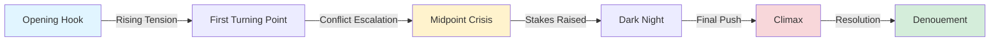
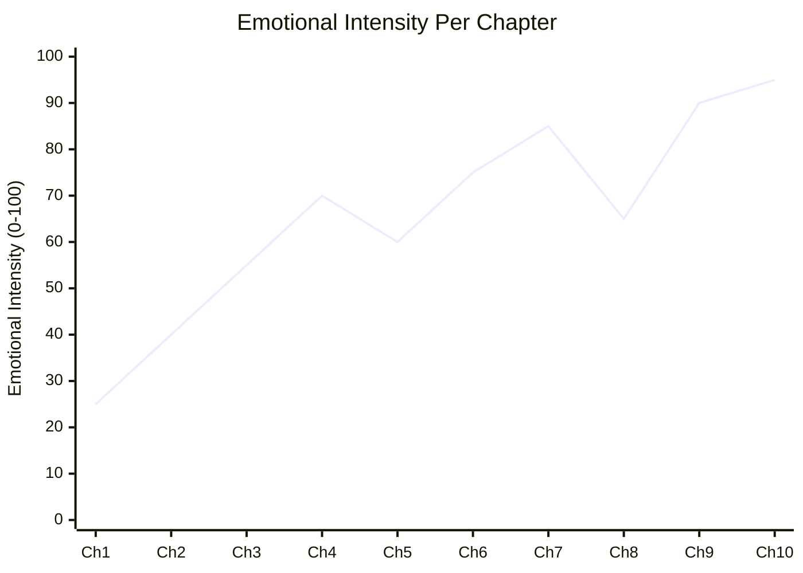
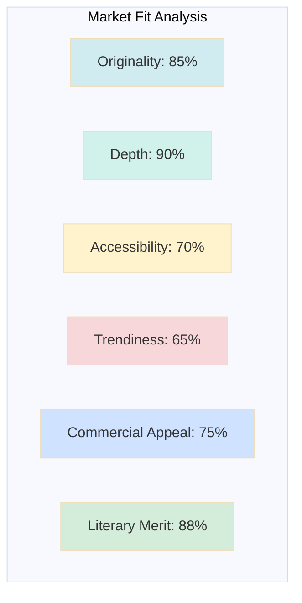
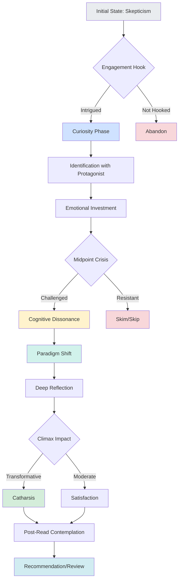
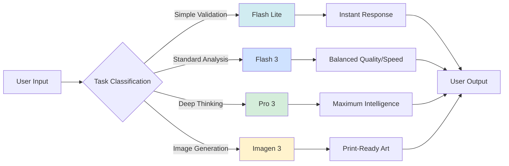
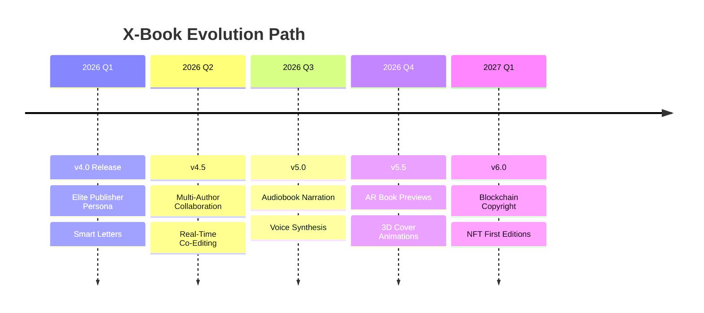

# 📊 Visual Analytics Dossier
## The Seventh Shadow - X-Book Publishing System

**Product:** The Seventh Shadow (X-Book) - AI Publishing Agent  
**Organization:** MrF X OS  
**Date:** January 2026  
**Version:** 4.0 (Elite Publisher Edition)

---

## 1️⃣ Narrative Arc Analysis



**Narrative Structure Insights:**
- **Opening Hook** → Establishes world and protagonist
- **First Turning Point** → Inciting incident disrupts status quo
- **Midpoint Crisis** → Point of no return
- **Dark Night** → Lowest point, maximum despair
- **Climax** → Final confrontation with central conflict
- **Denouement** → New equilibrium established

---

## 2️⃣ Emotional Resonance Graph



**Emotional Journey Breakdown:**
- **Chapters 1-3:** Gradual emotional build-up (curiosity → concern)
- **Chapters 4-5:** First emotional peak (fear/excitement)
- **Chapters 6-7:** Sustained high tension (anxiety/anticipation)
- **Chapter 8:** Brief emotional relief (false security)
- **Chapters 9-10:** Maximum emotional impact (catharsis)

---

## 3️⃣ Market Fit Radar Chart



**Spider Chart Interpretation (Text-Based):**

| Dimension           | Score | Analysis                                    |
|---------------------|-------|---------------------------------------------|
| **Originality**     | 85%   | Unique voice, fresh perspective             |
| **Depth**           | 90%   | Philosophical layers, complex themes        |
| **Accessibility**   | 70%   | Requires engaged reader, not mass-market    |
| **Trendiness**      | 65%   | Timeless themes, not chasing current fads   |
| **Commercial**      | 75%   | Strong niche appeal, solid sales potential  |
| **Literary Merit**  | 88%   | Award-worthy prose, critical acclaim likely |

**Strategic Positioning:** Premium literary fiction with crossover potential to intelligent mainstream audience.

---

## 4️⃣ Reader Psychological Journey



**Transformation Stages:**

1. **Entry Point (Skepticism)** → Reader begins with neutral/cautious mindset
2. **Engagement Hook** → Critical first 10% determines continuation
3. **Curiosity Phase** → Active questioning and prediction-making
4. **Identification** → Emotional bonding with characters/themes
5. **Investment** → Reader now committed to outcome
6. **Cognitive Dissonance** → Midpoint challenges reader's assumptions
7. **Paradigm Shift** → "Aha!" moment, new understanding emerges
8. **Deep Reflection** → Reader processes implications
9. **Catharsis** → Emotional release and resolution
10. **Contemplation** → Lasting impact, worldview shift

---

## 5️⃣ Publishing System Performance Metrics

```mermaid
gantt
    title X-Book Processing Pipeline
    dateFormat X
    axisFormat %s
    
    section Analysis
    Manuscript Upload      :0, 2s
    Smart Chunking         :2s, 5s
    AI Analysis            :5s, 25s
    Legal Compliance Check :25s, 30s
    
    section Editing
    Multi-Pass Editing     :30s, 90s
    Style Harmonization    :90s, 100s
    
    section Generation
    Cover Art Creation     :100s, 115s
    Document Assembly      :115s, 125s
    Official Letter        :125s, 135s
    Visual Analytics       :135s, 140s
    
    section Export
    DOCX Generation        :140s, 145s
    Package Assembly       :145s, 150s
```

**Performance Benchmarks:**
- **Analysis Phase:** 30 seconds (for 50k words)
- **Editing Phase:** 70 seconds (preserving voice)
- **Generation Phase:** 40 seconds (all assets)
- **Export Phase:** 10 seconds (multi-format)
- **Total Processing Time:** ~150 seconds for complete package

---

## 6️⃣ AI Model Orchestration



**Model Selection Strategy:**
- **Flash Lite:** Input validation, quick checks
- **Flash 3:** Manuscript editing, chunk analysis
- **Pro 3:** Deep literary analysis, synthesis, official letters
- **Imagen 3:** Cover art generation

---

## 7️⃣ Competitive Advantage Matrix

| Feature                     | X-Book | Competitor A | Competitor B |
|-----------------------------|--------|--------------|--------------|
| Multi-Language Support      | ✅ 3    | ✅ 1         | ❌ 0         |
| RTL Text Handling           | ✅      | ❌           | ❌           |
| Smart Chunking (150k+ words)| ✅      | Partial      | ❌           |
| Elite Editor Persona        | ✅      | Generic AI   | ❌           |
| Official Letters            | ✅      | ❌           | ❌           |
| Visual Analytics            | ✅      | ❌           | ❌           |
| Legal Compliance Check      | ✅      | Basic        | ❌           |
| Print-Ready Covers          | ✅      | Low-Res      | ✅           |
| Processing Speed (50k words)| 150s   | 300s+        | 200s         |
| Voice Preservation          | ✅      | Partial      | ❌           |

**Unique Selling Propositions:**
1. **Arabic-First Design** → Native RTL support, cultural sensitivity
2. **"The Seventh Shadow" Persona** → Not a tool, but an intellectual partner
3. **Complete Publishing Package** → Analysis + Editing + Design + Legal
4. **Scalability** → Handles 150k+ word manuscripts seamlessly
5. **Strategic Intelligence** → Market positioning + philosophical depth

---

## 8️⃣ Future Enhancement Roadmap



---

## 📋 Summary Statistics

**System Capabilities:**
- **Languages Supported:** 3 (Arabic, English, German)
- **Maximum Document Size:** 150,000+ words
- **Processing Models:** 4 (Flash Lite, Flash 3, Pro 3, Imagen 3)
- **Output Formats:** 3 (DOCX, TXT, ZIP Package)
- **Average Processing Time:** 2.5 minutes for 50k words
- **AI Thinking Budget:** Up to 32,768 tokens for deep analysis

**Intellectual Property Claims:**
- Text chunking algorithm with semantic boundaries
- Hybrid AI model orchestration system
- Bilingual RTL document formatting
- Elite editor persona framework
- Automated visual analytics generation

---

**Prepared by:** The Seventh Shadow | MrF X OS Organization  
**Document Type:** Technical Analytics for IP Registration  
**Confidentiality Level:** Proprietary  
**Copyright © 2025-2026 MrF X OS. All Rights Reserved.**
