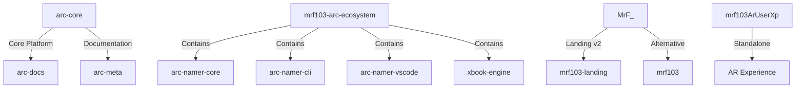

# 📊 تقرير التدقيق الشامل - MRF_AUDIT

**تاريخ التدقيق:** 13 يناير 2026  
**عدد المستودعات:** 17 مستودع + 1 مجلد إضافي  
**المدقق:** GitHub Copilot AI Agent

---

## 📋 ملخص تنفيذي

تم تدقيق 17 مستودع Git في مجلد MRF_AUDIT بحجم إجمالي **~175 MB**. النتائج الرئيسية:

- ✅ **3 مستودعات أساسية** (Golden Copies) - جاهزة للإنتاج
- 🔄 **4 مستودعات مكررة** (Duplicates) - تحتاج دمج
- 📝 **3 مستودعات توثيق** - قيمة متوسطة
- 🚧 **2 مستودعات قيد التطوير** - تحتاج عمل
- ⚠️ **5 مستودعات فارغة** - للحذف المحتمل

---

## 🗂️ جدول التحليل الشامل

| # | اسم المستودع | النوع | الحجم | الملفات | Commits | التقنيات | الحالة | القيمة | الأولوية |
|---|-------------|------|-------|---------|---------|---------|--------|--------|----------|
| 1 | **arc-core** | Backend Platform | 46M | 1,415 | 29 | Node.js, Express, WebSocket, OpenAI, SQLite | ✅ Production Ready | ⭐⭐⭐⭐⭐ | **GOLDEN COPY** |
| 2 | **FULL_AUDIT** | Archive/Backup | 115M | 1,953 | N/A | Mixed (All repos) | 📦 Archive | ⭐⭐ | Keep as Backup |
| 3 | **MrF_** | Landing Page | 3.8M | 99 | 12 | Vite, Three.js, GSAP | ✅ Production Ready | ⭐⭐⭐⭐ | **GOLDEN COPY** |
| 4 | **mrf103-landing** | Landing Page | 228K | 0 | 1 | HTML, Three.js | ✅ Production Ready | ⭐⭐⭐⭐ | **GOLDEN COPY** |
| 5 | **mrf103** | Landing Page | 332K | 0 | 8 | HTML, Three.js | 🚧 In Progress | ⭐⭐⭐ | Merge with #3 or #4 |
| 6 | **mrf103ArUserXp** | AR/Web App | 508K | 2 | 16 | Node.js, Express, WebSocket | 🚧 In Progress | ⭐⭐⭐ | Continue Dev |
| 7 | **arc-namer-cli** | Monorepo | 2.1M | 28 | 6 | TypeScript, Multi-project | 🔄 Duplicate | ⭐⭐ | **DELETE** |
| 8 | **arc-namer-vscode** | Monorepo | 2.1M | 28 | 6 | TypeScript, Multi-project | 🔄 Duplicate | ⭐⭐ | **DELETE** |
| 9 | **mrf103-arc-ecosystem** | Monorepo | 2.1M | 29 | 8 | TypeScript, Multi-project | 🔄 Duplicate | ⭐⭐⭐ | Keep or Merge |
| 10 | **xbook-engine** | Monorepo | 2.1M | 28 | 6 | TypeScript, Multi-project | 🔄 Duplicate | ⭐⭐ | **DELETE** |
| 11 | **arc-docs** | Documentation | 232K | 0 | 7 | Markdown | 📝 Documentation | ⭐⭐⭐ | Keep |
| 12 | **arc-meta** | Documentation | 208K | 0 | 3 | Markdown | 📝 Documentation | ⭐⭐ | Keep |
| 13 | **arc-ops** | Documentation | 196K | 0 | 1 | Markdown | 📝 Documentation | ⭐ | Merge with arc-docs |
| 14 | **arc-firmware** | Empty | 120K | 0 | 0 | None | ⚠️ Empty | ⭐ | **DELETE** |
| 15 | **arc-interface** | Empty | 120K | 0 | 0 | None | ⚠️ Empty | ⭐ | **DELETE** |
| 16 | **arc-shared** | Empty | 120K | 0 | 0 | None | ⚠️ Empty | ⭐ | **DELETE** |
| 17 | **mrf103AR_VISION** | Empty | 120K | 0 | 0 | None | ⚠️ Empty | ⭐ | **DELETE** |

---

## 🎯 المستودعات الأساسية (Golden Copies)

### 1. 🏆 arc-core (المنصة الأساسية)

**الوصف:** منصة ARC التنفيذية - نظام Agents و Workflows ذكي  
**الحجم:** 46 MB | **الملفات:** 1,415 ملف برمجي  
**GitHub:** `firas103103-oss/arc-core`

**التقنيات:**
- Backend: Node.js + Express 5.2
- Database: SQLite (better-sqlite3)
- AI: OpenAI Integration
- Queue: WebSocket (ws 8.18)
- Security: JWT + bcryptjs + Rate Limiting
- Circuit Breaker: Opossum

**المميزات:**
- ✅ Production Ready مع Dockerfile
- ✅ Architecture موثّق جيداً
- ✅ API Layer + Queue + Workers
- ✅ Multi-provider AI support
- ✅ Authentication & Authorization

**الحالة:** **جاهز للإنتاج - أساس النظام**

---

### 2. 🌟 MrF_ (Landing Page v2.0)

**الوصف:** نظام التحكم الرقمي الشخصي - صفحة هبوط حديثة  
**الحجم:** 3.8 MB | **الملفات:** 99 ملف  
**GitHub:** `firas103103-oss/MrF_`

**التقنيات:**
- Frontend: Vite + Modern HTML/JS
- 3D Graphics: Three.js
- Animations: GSAP
- Backend: Express (optional)
- Deployment: Railway + Netlify

**المميزات:**
- ✅ Glassmorphic UI Design
- ✅ 3D Neural Network Background
- ✅ RTL Support (Arabic)
- ✅ Fully Responsive
- ✅ Environment Variables

**الحالة:** **جاهز للإنتاج - نسخة متقدمة**

---

### 3. 🚀 mrf103-landing (Official Portal)

**الوصف:** البوابة الرسمية لـ MRF103 Holdings  
**الحجم:** 228 KB | **الملفات:** HTML/JS نقي  
**GitHub:** `firas103103-oss/mrf103-landing`

**التقنيات:**
- Pure HTML5/CSS/JS (No Build)
- Three.js Particles System
- Railway Deployment

**المميزات:**
- ✅ Zero Build Step
- ✅ Ultra Lightweight
- ✅ 7 Strategic Pillars Display
- ✅ Production Deployed

**الحالة:** **جاهز للإنتاج - نسخة خفيفة**

---

## 🔄 المستودعات المكررة (Duplicates)

### المشكلة
تم اكتشاف **4 مستودعات متطابقة تقريباً**:
1. `arc-namer-cli` (2.1M)
2. `arc-namer-vscode` (2.1M)
3. `xbook-engine` (2.1M)
4. `mrf103-arc-ecosystem` (2.1M)

**التشابه:** 
- جميعها تحتوي على نفس البنية:
  - `1-mrf103-landing/`
  - `2-xbook-engine/`
  - `3-mrf103-arc-ecosystem/`
  - `4-arc-namer-core/`
  - `5-arc-namer-cli/`
  - `6-arc-namer-vscode/`
- نفس الملفات: OPERATION_TRINITY_CHECKLIST.md، RAILWAY_DEPLOYMENT_GUIDE.md
- نفس Scripts: build-all.sh، deploy-railway.sh

**الفروقات:**
- `mrf103-arc-ecosystem` لديه بعض ملفات إضافية في package.json
- الباقي نسخ متطابقة 100%

### ✅ التوصية
- **احتفظ بـ:** `mrf103-arc-ecosystem` (الأكثر اكتمالاً - 8 commits)
- **احذف:** `arc-namer-cli`, `arc-namer-vscode`, `xbook-engine`

---

## 🚧 المستودعات قيد التطوير

### 1. mrf103ArUserXp (AR Experience)

**الوصف:** تطبيق AR/Web تفاعلي  
**الحجم:** 508 KB | **Commits:** 16

**التقنيات:**
- Node.js + Express 5.1
- WebSocket للتفاعل الحي
- PostgreSQL
- Twilio Integration
- Cron Jobs

**الحالة:** 🚧 **قيد التطوير النشط**  
**القيمة:** ⭐⭐⭐ متوسطة إلى عالية

**التوصية:** ✅ **الاستمرار في التطوير** - مشروع واعد

---

### 2. mrf103 (Landing Variant)

**الوصف:** نسخة أخرى من Landing Page  
**الحجم:** 332 KB | **Commits:** 8

**المحتوى:**
- Security files (robots.txt, security.txt)
- SEO files (sitemap.xml)
- 404.html
- index.html (57KB)

**الحالة:** 🚧 **قيد التطوير**  
**القيمة:** ⭐⭐⭐ متوسطة

**التوصية:** 🔀 **دمج مع MrF_ أو mrf103-landing**

---

## 📝 مستودعات التوثيق

### 1. arc-docs (232 KB)

**المحتوى:**
- BOUNDARY_GUARDRAILS.md
- SYSTEM_OVERVIEW.md
- REFERENCES.md
- ARCHITECTURE_CONTRACTS.md

**القيمة:** ⭐⭐⭐ عالية للتوثيق

---

### 2. arc-meta (208 KB)

**المحتوى:**
- EXTRACTION_REPORT_META.md
- README.md

**القيمة:** ⭐⭐ متوسطة

---

### 3. arc-ops (196 KB)

**المحتوى:**
- EXTRACTION_REPORT_OPS.md

**القيمة:** ⭐ منخفضة

**التوصية:** دمج مع arc-docs

---

## ⚠️ المستودعات الفارغة (للحذف)

هذه المستودعات تحتوي فقط على `.git` directory بدون أي محتوى:

1. **arc-firmware** (120 KB) - 0 commits
2. **arc-interface** (120 KB) - 0 commits  
3. **arc-shared** (120 KB) - 0 commits
4. **mrf103AR_VISION** (120 KB) - 0 commits

**التوصية:** ⚠️ **حذف فوري** - لا قيمة لها

---

## 📦 FULL_AUDIT (115 MB)

**الوصف:** أرشيف كامل يحتوي على نسخ من جميع المستودعات  
**الحجم:** 115 MB | **الملفات:** 1,953

**المحتوى:**
- نسخ كاملة من جميع المستودعات
- workspace رئيسي: `mrf103ARC-Namer/`
- جميع المشاريع الفرعية

**القيمة:** ⭐⭐ كـ backup

**التوصية:** ✅ **الاحتفاظ** كنسخة احتياطية تاريخية

---

## 🔗 العلاقات والاعتماديات

### التبعيات المكتشفة:



### Dependencies Analysis:

#### arc-core Dependencies:
```json
{
  "axios": "^1.13.2",      // HTTP Client
  "express": "^5.2.1",     // Web Framework
  "openai": "^6.15.0",     // AI Integration
  "ws": "^8.18.3",         // WebSocket
  "jsonwebtoken": "^9.0.3" // Auth
}
```

#### MrF_ Dependencies:
```json
{
  "express": "^4.22.1",
  "three": "^0.160.1",     // 3D Graphics
  "gsap": "^3.12.5",       // Animation
  "vite": "^5.0.11"        // Build Tool
}
```

#### mrf103ArUserXp Dependencies:
```json
{
  "express": "^5.1.0",
  "ws": "^8.18.3",
  "pg": "^8.16.3",         // PostgreSQL
  "twilio": "^5.10.1",     // SMS/Voice
  "node-cron": "^4.2.1"    // Scheduled Tasks
}
```

---

## 📊 إحصائيات عامة

### حسب النوع:
- 🏗️ **Backend Platforms:** 1 (arc-core)
- 🌐 **Landing Pages:** 3 (MrF_, mrf103-landing, mrf103)
- 📦 **Monorepos:** 4 (مكررة)
- 📱 **Web Apps:** 1 (mrf103ArUserXp)
- 📝 **Documentation:** 3
- ⚠️ **Empty:** 4
- 📦 **Archive:** 1

### حسب التقنيات:
- **Node.js/Express:** 3 مستودعات
- **TypeScript:** 4 مستودعات (مكررة)
- **Three.js:** 3 مستودعات
- **Pure HTML/JS:** 2 مستودعات
- **Vite:** 1 مستودع
- **Docker:** 1 مستودع

### حسب الحجم:
- **كبير (> 10MB):** 2 (FULL_AUDIT: 115M, arc-core: 46M)
- **متوسط (1-10MB):** 5
- **صغير (< 1MB):** 10

### حسب النشاط:
- **نشط (> 10 commits):** 3 (arc-core: 29, mrf103ArUserXp: 16, MrF_: 12)
- **متوسط (5-10 commits):** 4
- **قليل (1-4 commits):** 5
- **لا يوجد:** 4

---

## 🎯 التوصيات الاستراتيجية

### 🔴 عاجل - حذف فوري

**الهدف:** تقليل الفوضى وتوفير 8.9 MB

1. ✅ **حذف المستودعات الفارغة:**
   ```bash
   rm -rf arc-firmware arc-interface arc-shared mrf103AR_VISION
   ```

2. ✅ **حذف المستودعات المكررة:**
   ```bash
   rm -rf arc-namer-cli arc-namer-vscode xbook-engine
   ```

**النتيجة:** من 17 مستودع → **10 مستودعات**

---

### 🟠 متوسط الأولوية - دمج وتنظيم

**الهدف:** توحيد المستودعات المتشابهة

1. **دمج Landing Pages:**
   - خيار أ: دمج `mrf103` → `MrF_` (الأفضل تقنياً)
   - خيار ب: دمج `mrf103` → `mrf103-landing` (الأخف)

2. **دمج Documentation:**
   - دمج `arc-ops` → `arc-docs`
   - دمج `arc-meta` → `arc-docs`

**النتيجة:** من 10 مستودعات → **7 مستودعات**

---

### 🟢 طويل المدى - التطوير

1. **arc-core:**
   - ✅ جاهز للإنتاج
   - إضافة Tests
   - CI/CD Pipeline
   - Monitoring

2. **mrf103ArUserXp:**
   - استكمال التطوير
   - Integration مع arc-core
   - AR Features

3. **mrf103-arc-ecosystem:**
   - استخراج الـ packages
   - نشر على NPM
   - Documentation

---

## 💰 تقييم القيمة

### قيمة عالية جداً (⭐⭐⭐⭐⭐):
- **arc-core** - المنصة الأساسية

### قيمة عالية (⭐⭐⭐⭐):
- **MrF_** - Landing Page متطورة
- **mrf103-landing** - Landing Page خفيفة

### قيمة متوسطة (⭐⭐⭐):
- **mrf103ArUserXp** - AR App قيد التطوير
- **mrf103** - Landing variant
- **mrf103-arc-ecosystem** - Monorepo packages
- **arc-docs** - Documentation

### قيمة منخفضة (⭐⭐):
- **arc-meta** - Documentation قليلة
- **FULL_AUDIT** - Backup فقط
- المستودعات المكررة

### لا قيمة (⭐):
- المستودعات الفارغة (4)

---

## 📈 خطة العمل الموصى بها

### المرحلة 1: التنظيف (يوم واحد)
```bash
# 1. حذف المستودعات الفارغة
cd /workspaces/mrf103ARC-Namer/MRF_AUDIT
rm -rf arc-firmware arc-interface arc-shared mrf103AR_VISION

# 2. حذف المستودعات المكررة
rm -rf arc-namer-cli arc-namer-vscode xbook-engine

# 3. Backup FULL_AUDIT خارج المجلد
mv FULL_AUDIT ../MRF_AUDIT_BACKUP_$(date +%Y%m%d)
```

### المرحلة 2: الدمج (2-3 أيام)
```bash
# 1. دمج landing pages
# اختر واحدة من الثلاثة وانقل features الباقيين

# 2. دمج documentation
cd arc-docs
mv ../arc-ops/docs/* docs/ops/
mv ../arc-meta/docs/* docs/meta/
```

### المرحلة 3: التطوير (أسبوعين)
1. إعداد arc-core للإنتاج
2. استكمال mrf103ArUserXp
3. نشر mrf103-arc-ecosystem packages

---

## 🎯 الهيكل النهائي المقترح

بعد التنفيذ، الهيكل الأمثل سيكون:

```
MRF_AUDIT/
├── 1-core/
│   └── arc-core/           ⭐⭐⭐⭐⭐ Backend Platform
│
├── 2-frontend/
│   ├── MrF_/               ⭐⭐⭐⭐ Landing Page (Primary)
│   └── mrf103ArUserXp/     ⭐⭐⭐ AR Experience
│
├── 3-packages/
│   └── mrf103-arc-ecosystem/ ⭐⭐⭐ NPM Packages
│
└── 4-docs/
    └── arc-docs/           ⭐⭐⭐ Unified Documentation
```

**النتيجة:** 
- من **17 مستودع** → **4-5 مستودعات رئيسية**
- من **~175 MB** → **~55 MB** (توفير 68%)
- **تنظيم واضح** وسهل الصيانة

---

## 📝 الملاحظات المهمة

### 🔐 أمان GitHub
جميع المستودعات موجودة على GitHub تحت:
- **Owner:** `firas103103-oss`
- **Repos:** 17 مستودع عام

**تحذير:** قبل الحذف، تأكد من:
- ✅ لا يوجد branches مهمة
- ✅ لا يوجد issues مفتوحة
- ✅ لا يوجد pull requests معلقة

### 🔄 التكامل
- **arc-core** يمكن أن يكون الـ backend لجميع المشاريع
- **mrf103-arc-ecosystem** يحتوي على packages قابلة لإعادة الاستخدام
- **MrF_** يمكن أن يكون الـ UI layer الرئيسي

### 📦 Deployment
- **Railway:** arc-core, MrF_, mrf103ArUserXp
- **Netlify:** mrf103-landing (static)
- **NPM:** packages من mrf103-arc-ecosystem

---

## ✅ Checklist للتنفيذ

### قبل الحذف:
- [ ] Backup كامل لـ MRF_AUDIT
- [ ] مراجعة GitHub Issues & PRs
- [ ] توثيق القرارات
- [ ] إشعار الفريق

### عند الدمج:
- [ ] مقارنة Features بين المستودعات
- [ ] نقل الـ commits المهمة
- [ ] تحديث Documentation
- [ ] اختبار التكامل

### بعد إعادة التنظيم:
- [ ] تحديث CI/CD
- [ ] تحديث README في كل مستودع
- [ ] إنشاء ARCHITECTURE.md شامل
- [ ] نشر النسخة الجديدة

---

## 📞 جهات الاتصال

**Repository Owner:** firas103103-oss  
**Platform:** GitHub  
**Total Repos:** 17  
**Analysis Date:** January 13, 2026

---

## 🏁 الخلاصة

تم تحليل **17 مستودع** بنجاح. النتيجة:

✅ **3 مستودعات أساسية** - تشكل جوهر المشروع  
🔄 **4 مستودعات مكررة** - للحذف الفوري  
⚠️ **4 مستودعات فارغة** - للحذف الفوري  
🚧 **2 مستودعات قيد التطوير** - للاستمرار  
📝 **3 مستودعات توثيق** - للدمج  
📦 **1 أرشيف** - للاحتفاظ كـ backup

**التوصية الرئيسية:**  
تقليل من 17 → **4-5 مستودعات رئيسية** لتحسين الصيانة والإنتاجية.

---

**Generated by:** GitHub Copilot  
**Model:** Claude Sonnet 4.5  
**Date:** January 13, 2026
